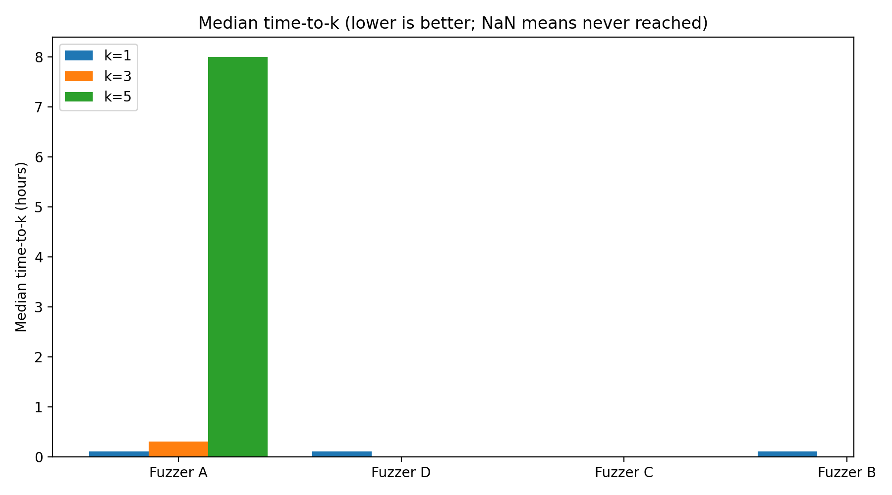
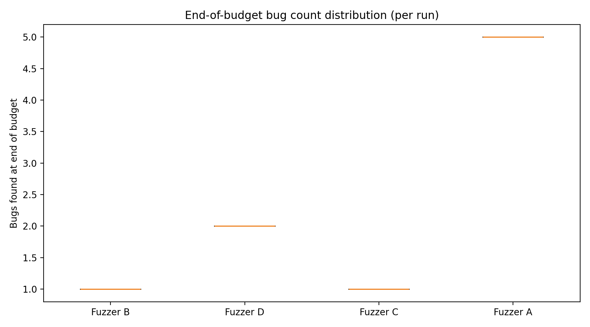

# scfuzzbench

Benchmark suite for smart-contract fuzzers.

<table>
  <tr>
    <td></td>
    <td></td>
  </tr>
  <tr>
    <td></td>
    <td></td>
  </tr>
</table>

## How it works

Terraform in `infrastructure/` provisions a per-run shard queue and launches
up to `max_parallel_instances` worker instances.
Each worker:
- Claims one `(fuzzer, run_index)` shard from S3 (`runs/<run_id>/<benchmark_uuid>/queue/shards/*.json`).
- Installs that shard's fuzzer on demand (`fuzzers/<name>/install.sh`).
- Clones the target repo at the pinned commit.
- Runs `forge build`.
- Executes `run.sh` under `timeout` so every shard stops at the deadline.
- Retries failed shards with exponential backoff until `shard_max_attempts`.

Artifacts:
- Logs:
  `s3://<bucket>/logs/<run_id>/<benchmark_uuid>/i-XXXX-<fuzzer-version>.zip`
- Corpus output (when configured):
  `s3://<bucket>/corpus/<run_id>/<benchmark_uuid>/i-XXXX-<fuzzer-version>.zip`
- Runner metrics (CPU/memory/load) are recorded in `runner_metrics.csv` inside each logs zip.

`<run_id>` defaults to a unix timestamp captured once per Terraform state (via
`time_static`), so repeated `terraform apply` may reuse the same value. To force
a fresh run ID, set `run_id` explicitly (for example `-var 'run_id=...'` or
`TF_VAR_run_id=...`). `benchmark_uuid` is an MD5 of a manifest including the
scfuzzbench commit, target repo/ref, benchmark type, instance type, and fuzzer
versions; a `manifest.json` is uploaded alongside the logs.

Benchmark type:
- `benchmark_type` controls whether the run uses `property` (default) or
  `optimization` mode.
- The runner uses `SCFUZZBENCH_PROPERTIES_PATH` (set via `fuzzer_env`) to locate
  the properties file and applies the sed transformations noted in that file
  before building/running.

Analysis:
- `analysis/analyze.py` parses logs into `events.csv` + summary tables.
- Charts are generated by `analysis/benchmark_report.py` from the cumulative
  CSV (`fuzzer, run_id, time_hours, bugs_found`).
- Install plotting deps with `pip install -r analysis/requirements.txt`.

CSV report:
- `analysis/benchmark_report.py` consumes a long-form CSV
  (`fuzzer, run_id, time_hours, bugs_found`) and produces a Markdown report plus
  plots (median+IQR curves, time-to-k, end distribution, plateau/late-share).
- Use `analysis/wide_to_long.py` if your CSV is in wide format.
- `analysis/events_to_cumulative.py` converts `events.csv` (from log parsing)
  into this cumulative CSV format.

## Benchmark inputs

Set these inputs via `-var`/`tfvars` when you run Terraform
(defaults are intentionally blank):

- `target_repo_url` and `target_commit`
- `benchmark_type` (`property` or `optimization`)
- `instance_type`, `instances_per_fuzzer`, `max_parallel_instances`, `timeout_hours`
- `fuzzers` (allowlist of fuzzer keys to run; empty runs all available fuzzers)
- fuzzer versions (and `foundry_git_repo`/`foundry_git_ref` if building from
  source)
- `git_token_ssm_parameter_name` if the target repo is private
- `SCFUZZBENCH_PROPERTIES_PATH` in `fuzzer_env` to point at the properties file
  used for mode switching

Per-fuzzer environment variables live in `fuzzers/README.md`.

## Quick start

```bash
make terraform-init
make terraform-deploy TF_ARGS="-var 'ssh_cidr=YOUR_IP/32' -var 'target_repo_url=REPO_URL' -var 'target_commit=COMMIT'"
```

### Local `.env` (recommended)

For repeatable local runs, keep a gitignored `.env` with your `AWS_PROFILE`,
Makefile variables, and `TF_VAR_*` Terraform variables:

```bash
# Usage: source .env
export AWS_PROFILE="your-profile"
export EXISTING_BUCKET="scfuzzbench-logs-..."
export TF_VAR_target_repo_url="https://github.com/org/repo"
export TF_VAR_target_commit="..."
export TF_VAR_timeout_hours=1
export TF_VAR_instances_per_fuzzer=4
export TF_VAR_fuzzers='["echidna","medusa","foundry"]'
export TF_VAR_git_token_ssm_parameter_name="/scfuzzbench/recon/github_token"
export TF_VAR_foundry_git_repo="https://github.com/your-org/foundry"
export TF_VAR_foundry_git_ref="master"
```

## Re-run a benchmark

Instances are one-shot: after `run.sh` completes they upload artifacts and stop
themselves, and they will not automatically re-run on start (a bootstrap
sentinel is written).

To re-run with the same state and bucket:

```bash
# Pick a new run_id so the S3 prefix is unique.
export TF_VAR_run_id="$(date +%s)"

# Recreate the EC2 instances so user-data runs again.
make terraform-destroy-infra TF_ARGS="-auto-approve -input=false"
make terraform-deploy TF_ARGS="-auto-approve -input=false"
```

Remote state (recommended for multi-machine runs):

1) Create the backend resources (S3 + DynamoDB lock table):
```bash
aws s3api create-bucket --bucket <state-bucket> --region us-east-1
aws s3api put-bucket-versioning --bucket <state-bucket> --versioning-configuration Status=Enabled
aws dynamodb create-table \
  --table-name <lock-table> \
  --attribute-definitions AttributeName=LockID,AttributeType=S \
  --key-schema AttributeName=LockID,KeyType=HASH \
  --billing-mode PAY_PER_REQUEST
```
2) Create `infrastructure/backend.hcl` from the template:
```bash
cp infrastructure/backend.hcl.template infrastructure/backend.hcl
```
3) Initialize + migrate state:
```bash
make terraform-init-backend
```

## Buckets

Buckets are intended to be long-lived. If you want to reuse an existing bucket
across runs, set `EXISTING_BUCKET=<bucket-name>` so Terraform uses
`existing_bucket_name` and only the `<benchmark_uuid>/<run_id>` prefix changes.
Avoid purging the bucket unless you explicitly want to delete historical runs.

If the state already manages the bucket resources (for example, from an older
deployment that created the bucket), remove those resources from state before
switching to `EXISTING_BUCKET`. Otherwise, Terraform will try to delete the
bucket when the resources disappear from config.

```bash
AWS_PROFILE=your-profile terraform -chdir=infrastructure state rm \
  aws_s3_bucket.logs \
  aws_s3_bucket_public_access_block.logs \
  aws_s3_bucket_server_side_encryption_configuration.logs \
  aws_s3_bucket_versioning.logs
```

If you need to tear down infra but keep the bucket:

```bash
make terraform-destroy-infra
```

## Analyze results

After downloading logs and unzip (single-pass analysis + charts):

```bash
DEST="$(mktemp -d /tmp/scfuzzbench-analysis-1770053924-XXXXXX)"
make results-analyze-all BUCKET=<bucket-name> RUN_ID=1770053924 BENCHMARK_UUID=<benchmark_uuid> DEST="$DEST" ARTIFACT_CATEGORY=both
```

Notes:
- `timeout_hours` applies to the *fuzzer command* only; cloning, dependency install, and builds happen before the timeout.
- Queue-mode runs are "ready/complete" when `runs/<run_id>/<benchmark_uuid>/status/run.json` reports terminal `status` (`completed` or `failed`).
- Quick readiness check (returns `0` until uploads start):

```bash
aws s3api list-objects-v2 --bucket "$BUCKET" --prefix "logs/$BENCHMARK_UUID/$RUN_ID/" --max-keys 1000 --query 'KeyCount' --output text
aws s3api list-objects-v2 --bucket "$BUCKET" --prefix "corpus/$BENCHMARK_UUID/$RUN_ID/" --max-keys 1000 --query 'KeyCount' --output text
aws s3 cp "s3://$BUCKET/runs/$RUN_ID/$BENCHMARK_UUID/status/run.json" -
```

Corpus note: by default, Echidna and Medusa upload corpus zips; Foundry uploads logs only.

Outputs under `DEST`:
- Prepared per-instance logs: `analysis/`
- CSVs: `data/`
- Plots: `images/`

If you reuse an existing bucket, set `EXISTING_BUCKET=<bucket-name>` so
Terraform uses `existing_bucket_name`. To download artifacts from the new
layout, pass the benchmark UUID:

```bash
make results-download BUCKET=<bucket-name> RUN_ID=1770053924 BENCHMARK_UUID=<benchmark_uuid> ARTIFACT_CATEGORY=both
```

You can read `benchmark_uuid` (and `run_id`) from `terraform output`.

If `data/events.csv` is empty, start by inspecting the raw fuzzer logs for
early exits or CLI usage errors:

```bash
make results-inspect DEST="$DEST"
rg -n \"error:|Usage:|cannot parse value\" \"$DEST/analysis\" -S
```

If `make results-prepare` prints `Copied 0 log file(s)`, the fuzzers likely
exited before they ever wrote `*.log`. In that case, check the EC2 console
output for bootstrap errors (git auth, build failures, etc.):

```bash
aws ec2 get-console-output --instance-id i-0123456789abcdef0 --latest --output json \
  | jq -r '.Output' | tail -n 200
```

## GitHub Actions

Two workflows publish runs and releases directly from CI/CD:

- `Benchmark Run` (`.github/workflows/benchmark-run.yml`)
  - Dispatch with inputs for repo/commit, benchmark type, instance type/count, and timeout hours.
  - Uses existing bucket from `SCFUZZBENCH_BUCKET` and region from `AWS_REGION`.
  - Uses explicit worker parallelism via `max_parallel_instances` (0 means all requested shards).
  - Enforces a **global mutex** (`benchmark-global-lock`): only one benchmark run is active at a time.
  - New run requests wait with backoff until the active lock holder completes or the lock expires.
  - Queue workers renew the lock lease while shards are still being processed.
  - If lock renew fails repeatedly, workers fail closed and stop shard processing to avoid overlap with future runs.
  - Lock orchestration is centralized in `scripts/benchmark_lock.py` (S3 lease acquire/renew/release).
  - `SCFUZZBENCH_LOCK_ACQUIRE_TIMEOUT_SECONDS=0` (default) means lock waiting does not time out by policy. Set it to `>0` for explicit fail-fast behavior.
  - Lock waiting is still bounded by GitHub Actions job runtime limits.
  - Lock state is stored in S3 (`runs/control/locks/<lock_name>/...`) and expires automatically via lease timestamps, so no manual lock-table cleanup is required.
  - Required secrets: `AWS_ACCESS_KEY_ID`, `AWS_SECRET_ACCESS_KEY`, `AWS_REGION`, `SCFUZZBENCH_BUCKET`,
    `TF_BACKEND_CONFIG` (for remote state).
  - The run ID is auto-generated at dispatch time.

- `Benchmark Release` (`.github/workflows/benchmark-release.yml`)
  - Dispatch manually with `benchmark_uuid` + `run_id`, or let the hourly schedule pick up completed runs.
  - Queue-mode runs are considered complete when `runs/<run_id>/<benchmark_uuid>/status/run.json` is terminal.
  - Legacy runs (without queue metadata) still use `run_id + timeout_hours + 1 hour`.
  - Publishes a GitHub release tagged `scfuzzbench-<benchmark_uuid>-<run_id>`.
  - Release notes are based on `REPORT.md` with an appended artifacts section.
  - Analysis artifacts (REPORT + charts + bundles) are uploaded to:
    `s3://<bucket>/analysis/<benchmark_uuid>/<run_id>/`.
  - If a run is complete but **missing** analysis artifacts, the release pipeline did not finish; re-run
    Benchmark Release or manually analyze/upload (see `docs/methodology.md`).

The logs bucket is configured for public read so the release can link directly to S3-hosted charts
and zip bundles.

## CSV report

```bash
make report-benchmark REPORT_CSV=results.csv REPORT_OUT_DIR=report_out REPORT_BUDGET=24
```

## Private repos

If you need to clone a private target repo, store a short-lived token in SSM
and set `git_token_ssm_parameter_name` so the instances can fetch it without
embedding secrets in user-data logs.

Update the token value:

```bash
aws ssm put-parameter \
  --name "/scfuzzbench/recon/github_token" \
  --type "SecureString" \
  --value "$GITHUB_TOKEN" \
  --overwrite
```

Notes:
- For public repos, leave `git_token_ssm_parameter_name` empty. If it is set,
  the runner will still attempt an unauthenticated clone first and only use the
  token if needed.
- If you see `Invalid username or token` in console output and only
  `runner_metrics.csv` uploads (no `*.log`), your SSM token value is invalid.
